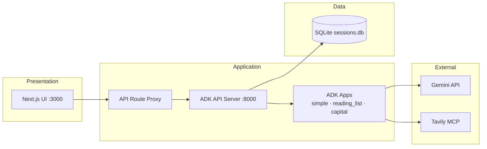
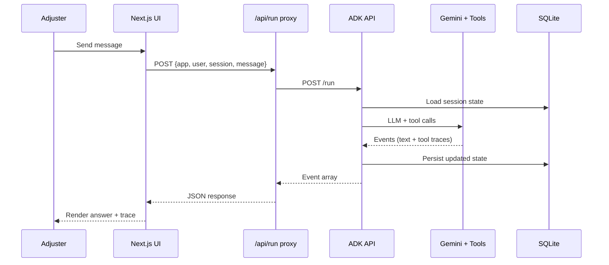
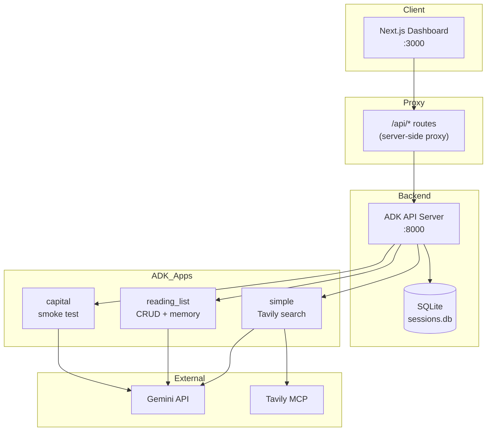

# production-adk-agent-google

[](LICENSE)
[](https://www.python.org/downloads/)
[](https://nextjs.org/)
[](https://google.github.io/adk-docs/)
[](https://cloud.google.com/run)

> Internal claims-assistant platform built with **Google ADK** — custom tools, persistent session state, REST API, **Next.js** dashboard, and **Google Cloud Run** deployment.

**Repo:** [github.com/MvMukesh/production-adk-agent-google](https://github.com/MvMukesh/production-adk-agent-google)

---

## Situation → Task → Action → Result

| | |
|---|---|
| **Situation** | Shipped an AI pipeline for document verification (KYC, policy docs). Operations teams still spent **15–30+ minutes** per FNOL on lookup, drafting, and consistency checks. |
| **Task** | Design a safe internal tool that could speed up first response without replacing licensed adjusters or bypassing compliance. |
| **Action** | Built an ADK service with custom tools (customer plan, open-claim load, KB search). Added persistent session/state for repeat claimants. Wrapped it in a REST API. Built a **Next.js** dashboard for adjusters. Deployed to **Google Cloud Run** with IAM/service accounts. |
| **Result** | Faster draft generation for FNOL intake · More consistent responses grounded in policy KB · Clear audit path: memory, RAG chunks, and tool traces for every recommendation. |

---

## Highlights

| Capability | Implementation |
|------------|----------------|
| **Orchestration** | [Google ADK](https://google.github.io/adk-docs/) — instruction engineering, tool design, multi-app routing |
| **Custom tools** | CRUD function calling + Tavily MCP web search |
| **Persistent state** | SQLite-backed sessions survive restarts (`DatabaseSessionService`) |
| **REST API** | ADK FastAPI server — `/run`, `/list-apps`, session CRUD |
| **Frontend** | Next.js 15 App Router + Tailwind — server-side API proxy, no CORS |
| **Deployment** | Docker Compose locally · Cloud Run + GCP IAM in production |
| **Observability** | Tool-trace panel, search-query extraction, event JSON audit |

---

## System design

### Context

Adjusters handle FNOL (First Notice of Loss) intake under time pressure. Upstream OCR/LLM already extracts fields from policy documents; the remaining bottleneck is **reasoning** — triaging the case, looking up SOPs, recalling prior interactions, and drafting a coverage note.

This system sits in that gap: a **human-in-the-loop** assistant that drafts recommendations. A licensed adjuster always reviews before anything is sent to a claimant.

### Goals

| Goal | How we meet it |
|------|----------------|
| Speed up intake | Multi-step tool use + KB search in one conversation |
| Consistency | Persistent session state per user/claim |
| Auditability | Tool traces, search queries, and session events logged in UI |
| Safe rollout | Adjuster approves every output; no autonomous sends |
| Ops-friendly deploy | Docker locally, Cloud Run in prod, IAM for secrets |

### Non-functional requirements

| NFR | Target |
|-----|--------|
| Latency (P95 run) | < 30 s for search-backed answers (depends on Tavily + Gemini) |
| Availability | Cloud Run auto-scale; health checks on API + UI |
| Data durability | SQLite sessions persisted to disk / Docker volume |
| Security | No secrets in git; IAM + Secret Manager in prod |
| Observability | Event trace panel + structured ADK run events |

### Scale & boundaries

```
┌──────────────────────────────────────────────────────────────────┐
│  OUT OF SCOPE (handled elsewhere)                                │
│  · Document OCR / KYC extraction                                 │
│  · Policy issuance / billing                                     │
│  · Autonomous outbound comms to claimants                        │
├──────────────────────────────────────────────────────────────────┤
│  IN SCOPE (this repo)                                            │
│  · Multi-turn reasoning over claim context                       │
│  · Tool calls (KB search, state CRUD, web grounding)             │
│  · Session memory across restarts                                │
│  · Adjuster dashboard + REST API                                 │
│  · GCP deployment scripts                                        │
└──────────────────────────────────────────────────────────────────┘
```

---

## High-level design (HLD)

### Component view



### Deployment topology

**Local dev**

```
┌─────────────┐     ┌─────────────┐     ┌─────────────┐
│  Browser    │────▶│  Next.js    │────▶│  ADK API    │
│  :3000      │     │  /api/*     │     │  :8000      │
└─────────────┘     └─────────────┘     └──────┬──────┘
                                               │
                                        ┌──────▼──────┐
                                        │  SQLite     │
                                        │  ./data/    │
                                        └─────────────┘
```

**Production (Cloud Run)**

```
                    ┌─────────────────────────────┐
                    │  Cloud Run — ADK service    │
                    │  (single app per deploy)    │
                    │  IAM + Secret Manager       │
                    └──────────────┬──────────────┘
                                   │
              ┌────────────────────┼────────────────────┐
              ▼                    ▼                    ▼
        Gemini API           Tavily MCP           Cloud SQL / SQLite
```

### Request flow (chat turn)



### Module responsibilities

| Module | Responsibility |
|--------|----------------|
| `frontend/` | Adjuster UI, server-side proxy, session UX |
| `agents/*` | ADK app definitions, instructions, tool wiring |
| `common/` | Shared HTTP client + event parsing for Python callers |
| `config/` | Env-based settings, validation |
| `apps/cli/` | Headless reading-list demo (no HTTP) |
| `infra/cloud-run/` | GCP enable, deploy, smoke test |
| `scripts/` | Dev launchers with port fallback |

---

## Low-level design (LLD)

### ADK REST API contract

| Method | Path | Purpose |
|--------|------|---------|
| `GET` | `/list-apps` | Health + list loaded ADK apps |
| `POST` | `/apps/{app}/users/{user}/sessions/{id}` | Create session (optional initial state) |
| `GET` | `/apps/{app}/users/{user}/sessions` | List sessions for user |
| `POST` | `/run` | Execute one user turn |

**`/run` payload**

```json
{
  "app_name": "simple",
  "user_id": "adjuster-42",
  "session_id": "sess-abc",
  "new_message": {
    "role": "user",
    "parts": [{ "text": "What is the waiting period for policy X?" }]
  }
}
```

**Response:** array of ADK events. Final assistant text lives in `content.parts[].text`. Tool calls appear as nested `functionCall` / `function_call` nodes.

### Next.js proxy routes

| Route | Upstream | Notes |
|-------|----------|-------|
| `GET /api/health` | `GET /list-apps` | Returns latency + app list |
| `GET /api/apps` | `GET /list-apps` | Passthrough |
| `POST /api/sessions` | `POST .../sessions/{uuid}` | Generates session UUID server-side |
| `GET /api/sessions` | `GET .../sessions` | Query: `appName`, `userId` |
| `POST /api/run` | `POST /run` | 120 s timeout for LLM runs |

Proxy lives server-side so the browser never calls ADK directly — avoids CORS and keeps `ADK_API_BASE` off the client.

### Session & state model

```
Session key: (app_name, user_id, session_id)
Storage:     ADK DatabaseSessionService → SQLite (ADK_DB_URL)

reading_list initial state:
{
  "user_name": "",
  "reading_list": [
    { "title": "...", "url": "...", "tags": [], "status": "queued", "notes": "" }
  ]
}
```

`reading_list` tools mutate session state in-process; ADK persists after each turn. Restarting the API server does **not** wipe sessions when SQLite is on a mounted volume.

### ADK apps (LLD)

**`simple`** — web-grounded Q&A

- Model: `gemini-2.0-flash` (configurable via `AGENT_MODEL`)
- Tool: Tavily MCP (`npx -y tavily-mcp`) — must search before answering factual questions
- Instruction enforces cite-sources behaviour

**`reading_list`** — persistent curator

| Tool | Action |
|------|--------|
| `set_user_name` | Store display name in session |
| `add_item` | Append to `reading_list` |
| `list_items` | Filter by status/tag |
| `update_item` | Patch fields by 1-based index |
| `annotate_item` | Add notes |
| `remove_item` | Delete by index |

**`capital`** — minimal LLM Q&A, no tools. Used for Cloud Run deploy smoke tests.

### Frontend state machine (`useChat`)

```
[mount] → poll /api/health
        → create session (POST /api/sessions)
        → idle

idle + send → POST /api/run → append turn → idle
switch app → new session, clear history
new session → new UUID, clear history
```

### Key files (LLD map)

| Concern | File(s) |
|---------|---------|
| Env config | `config/settings.py` |
| Python HTTP client | `common/adk_client.py` |
| Event parsing | `common/event_parser.py`, `frontend/src/lib/event-parser.ts` |
| Server proxy | `frontend/src/lib/server/adk.ts` |
| Chat orchestration | `frontend/src/hooks/useChat.ts` |
| API launcher | `scripts/run_api_server.sh` |
| Cloud Run deploy | `infra/cloud-run/deploy.sh` |

### Error handling

| Layer | Behaviour |
|-------|-----------|
| ADK API down | UI shows "API Offline" badge; session create fails gracefully |
| Missing API keys | `settings.validate_*` raises at agent import time |
| Run timeout | Proxy aborts at 120 s; UI surfaces error banner |
| Port conflict | Launch scripts scan + fallback (+20 port range) |

---

## Architecture



```
production-adk-agent-google/
├── frontend/          Next.js 15 dashboard (App Router + Tailwind)
├── agents/
│   ├── simple/        Q&A + Tavily MCP web search
│   ├── reading_list/  Persistent CRUD tools + SQLite memory
│   └── capital/       Minimal Cloud Run smoke-test app
├── common/            Shared ADK HTTP client + event parser
├── config/            Centralized env settings
├── apps/cli/          Standalone reading-list CLI
├── infra/cloud-run/   GCP deploy scripts
├── scripts/           Run + smoke-test helpers
├── tests/             Unit tests (pytest)
└── docker-compose.yml Local production-like stack
```

---

## Quick start

### Prerequisites

- **Python 3.10+**
- **Node.js 18+** (Next.js frontend)
- **npx** (Tavily MCP for the search app)
- API keys: [Google AI Studio](https://aistudio.google.com/apikey) · [Tavily](https://tavily.com/)

### 1. Clone & configure

```bash
git clone https://github.com/MvMukesh/production-adk-agent-google.git
cd production-adk-agent-google

cp .env.example .env
# Edit .env — set GOOGLE_API_KEY and TAVILY_API_KEY
```

### 2. Install dependencies

```bash
pip install -r requirements.txt
make install-frontend
```

### 3. Run locally

```bash
# Terminal 1 — ADK API (all apps, SQLite sessions)
make run-api

# Terminal 2 — Next.js dashboard
make run-ui
```

Open **http://localhost:3000** → pick an app → chat.

The Next.js app proxies ADK calls through `/api/*` routes server-side. Set `ADK_API_BASE=http://localhost:8000` in `.env`.

### Smoke test (curl)

```bash
bash scripts/test_search.sh "What is RAG?"
ADK_APP_NAME=reading_list bash scripts/test_search.sh "Add Clean Code to my list"
```

### Reading-list CLI

```bash
make run-cli
```

---

## ADK apps

| App | App name | Tools | Use case |
|-----|----------|-------|----------|
| Research Assistant | `simple` | Tavily MCP search | Factual Q&A with web grounding + source citations |
| Reading List Curator | `reading_list` | CRUD state tools | Personal reading list with cross-session memory |
| Quick Facts | `capital` | None | Minimal Q&A · Cloud Run smoke test |

---

## Docker

```bash
cp .env.example .env   # set your keys
make docker-up
```

| Service | URL |
|---------|-----|
| API | http://localhost:8000 |
| UI | http://localhost:3000 |
| Sessions | Docker volume `adk-data` |

---

## Cloud Run deployment

```bash
# 1. Configure GCP
cp infra/cloud-run/env.example.sh infra/cloud-run/env.sh
# Edit env.sh with your project ID
source infra/cloud-run/env.sh

# 2. Enable APIs
make enable-gcp

# 3. Deploy (default: agents/simple)
make deploy

# 4. Test
export APP_URL="https://your-service-url"
bash infra/cloud-run/test.sh
```

Deploy a different app:

```bash
export CLOUD_RUN_AGENT_PATH=agents/reading_list
export ADK_APP_NAME=reading_list
make deploy
```

---

## Development

```bash
pip install -r requirements-dev.txt
make test                          # pytest unit tests
make clean                         # remove caches
cd frontend && npm run build       # verify production build
```

### Makefile targets

| Target | Description |
|--------|-------------|
| `make run-api` | Start ADK API server (port 8000, port fallback) |
| `make run-ui` | Start Next.js dev server (port 3000) |
| `make run-cli` | Interactive reading-list CLI |
| `make install-frontend` | `npm install` in `frontend/` |
| `make docker-up` | Build & start Docker Compose stack |
| `make deploy` | Deploy to Google Cloud Run |
| `make test` | Run unit tests |

---

## Configuration

See [`.env.example`](.env.example) for all variables.

| Variable | Default | Description |
|----------|---------|-------------|
| `GOOGLE_API_KEY` | — | **Required** — Gemini API key |
| `TAVILY_API_KEY` | — | **Required** for search app |
| `ADK_API_BASE` | `http://localhost:8000` | ADK API URL (Next.js proxy target) |
| `ADK_DB_URL` | `sqlite:///./data/sessions.db` | Persistent session storage |
| `ADK_APP_NAME` | `simple` | Default app in UI |
| `AGENT_MODEL` | `gemini-2.0-flash` | Gemini model |
| `NEXT_PORT` | `3000` | Next.js dev server port |
| `CLOUD_RUN_AGENT_PATH` | `agents/simple` | App folder for deploy |

---

## Problem → Solution

**Problem:** After automating document/KYC extraction, claims adjusters still manually triaged FNOL cases, searched policy SOPs, and drafted coverage notes.

**Solution:** A production-pattern ADK service — custom tools, persistent memory, REST API layer, adjuster dashboard, and Cloud Run deployment. Designed for **human-in-the-loop** safety: the model recommends; the adjuster approves. Includes audit context (memory + KB + tool traces).

| Layer | Gap at company | What this repo solves |
|-------|------------------|----------------------|
| Upstream | OCR + LLM extracted doc fields | — |
| Downstream | Manual FNOL triage + SOP search | Multi-step LLM reasoning with tools |
| Compliance | Black-box chatbots are risky | Human approves every draft |
| Scale | Peak claim volume spikes | Cloud Run scales API without managing servers |
| Audit | Regulators ask "why?" | Tool traces + RAG + memory audit trail |

---

## Security

- Never commit `.env` — use `.env.example` as template
- Rotate any keys previously stored in tutorial `.env` files
- Local ADK API has **no auth** — use IAM + identity tokens on Cloud Run for production
- Inject secrets via **GCP Secret Manager** in production deployments

---

## License

MIT — see [LICENSE](LICENSE).

Copyright © 2026 [Mukesh Manral](https://github.com/MvMukesh)
